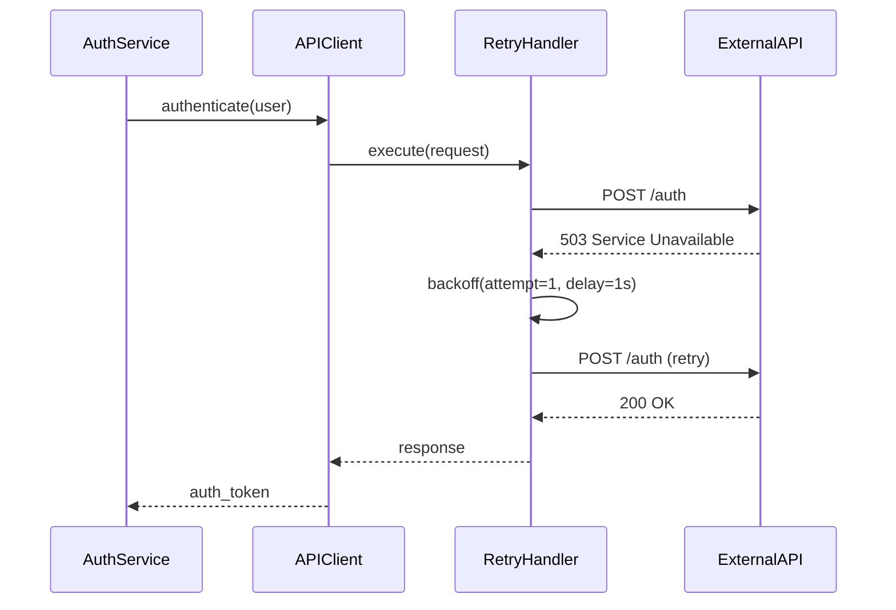

# Feature 3: PR Walkthrough with Sequence Diagrams

## Problem
PR reviews tell you what's wrong but not how the code flows. Reviewers unfamiliar with the codebase spend 20+ minutes tracing call chains before they can even start reviewing.

## Solution
New command `\ansieyes_walkthrough` that generates a visual walkthrough of a PR with:
- Plain-English change summary
- File changes grouped by purpose/feature
- Auto-generated Mermaid sequence diagram showing component interactions
- Impact analysis (files that could be affected but weren't modified)

## Trigger
`\ansieyes_walkthrough` - exact match, on PRs only.

## Architecture

```
\ansieyes_walkthrough on PR
    |
    v
handle_walkthrough_mention() [app.py]
    |
    +-- Validate: must be PR, not issue
    +-- Post processing message
    +-- Get PR file changes (patches)
    |
    v
walkthrough_generator.generate_walkthrough()
    |
    +-- Build prompt with PR data
    +-- Call Gemini API directly (google-generativeai)
    +-- Request JSON response with:
    |     - change_summary
    |     - file_groups [{group_name, files: [{name, purpose, changes}]}]
    |     - sequence_diagram (Mermaid code)
    |     - impact_analysis [files]
    +-- Validate Mermaid syntax
    +-- Return structured dict
    |
    v
output_formatter.format_walkthrough()
    |
    v
Post as GitHub comment
```

## New File: `walkthrough_generator.py`

```python
class WalkthroughGenerator:
    __init__(self, api_key)
    generate_walkthrough(title, body, file_changes, repo_url) -> dict
    _build_prompt(title, body, file_changes) -> str
    _validate_mermaid(mermaid_code) -> str
```

## Why Direct Gemini API (Not AI-Issue-Triage CLI)?
- AI-Issue-Triage has no walkthrough/diagram CLI module
- We need structured JSON output (not markdown)
- Simpler: one API call vs subprocess orchestration
- `google-generativeai` is already in requirements.txt

## Output Example

```markdown
# Ansieyes PR Walkthrough

> PR: **#42 - Add retry logic to API client** | Generated: 2026-05-16

## What Changed
This PR adds exponential backoff retry logic to the API client
and updates three downstream services to use the new retry handler.

## Change Groups

### API Client Core
| File | What Changed |
|------|-------------|
| `src/api/client.py` | Added `RetryHandler` class with exponential backoff |
| `src/api/config.py` | New retry configuration constants |

### Service Updates
| File | What Changed |
|------|-------------|
| `src/services/auth.py` | Switched to retry-enabled client |
| `src/services/data.py` | Switched to retry-enabled client |
| `src/services/notify.py` | Switched to retry-enabled client |

### Tests
| File | What Changed |
|------|-------------|
| `tests/test_retry.py` | New test suite for retry logic |

## Interaction Flow



## Potential Impact
These files were NOT modified but may be affected:
- `src/api/middleware.py` - Uses API client, may need retry awareness
- `src/services/billing.py` - Also uses API client
- `docs/api.md` - May need documentation update

---
<sub>Powered by Ansieyes</sub>
```

## Gemini Prompt Strategy

The prompt will:
1. Include all file changes with patches
2. Request a specific JSON schema
3. Explicitly ask for a Mermaid sequence diagram
4. Request impact analysis of unmodified files

```
You are an expert code analyst. Analyze this pull request and return ONLY valid JSON.

{
  "change_summary": "2-3 sentence plain English summary",
  "file_groups": [
    {
      "group_name": "Feature/area name",
      "files": [
        {"name": "path/file.py", "purpose": "what this file does", "changes": "what changed"}
      ]
    }
  ],
  "sequence_diagram": "Valid Mermaid sequenceDiagram code showing the runtime interaction flow",
  "impact_analysis": ["path/to/potentially-affected-file.py"]
}
```

## Mermaid Validation
- Check that output starts with `sequenceDiagram` keyword
- Fallback: generate a simple file-dependency diagram if sequence diagram is invalid
- Wrap in collapsible section if very long (>20 lines)

## No New Dependencies
Uses existing `google-generativeai` and `GEMINI_API_KEY`.
